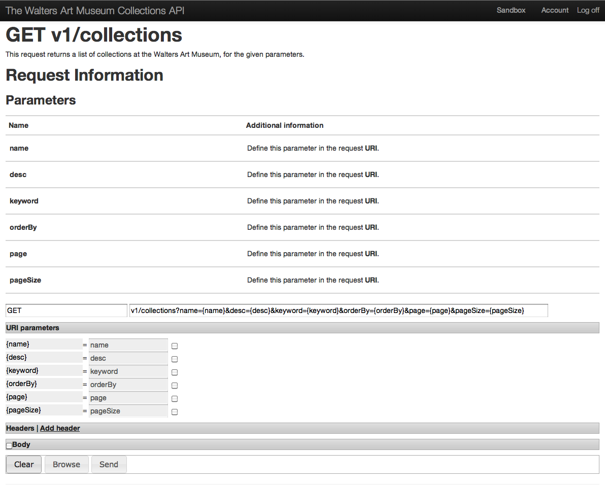

Walters Art Museum Collections API (Beta)
================================================================================

# API Sandbox

In addition to this documentation, one great way to learn to use the Walters Art Museum API is to test your queries using the API Sandbox. The API Sandbox was created to allow you to test out the API, using different requests, to get different responses, before you begin developing. 

The API Sandbox is available at http://api.thewalters.org/help/index   

##The Query Widget

On the sandbox site, you'll find a query widget for each of the API calls. Here you can test, combine and see results from the various calls and their parameters.
